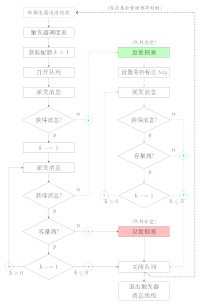
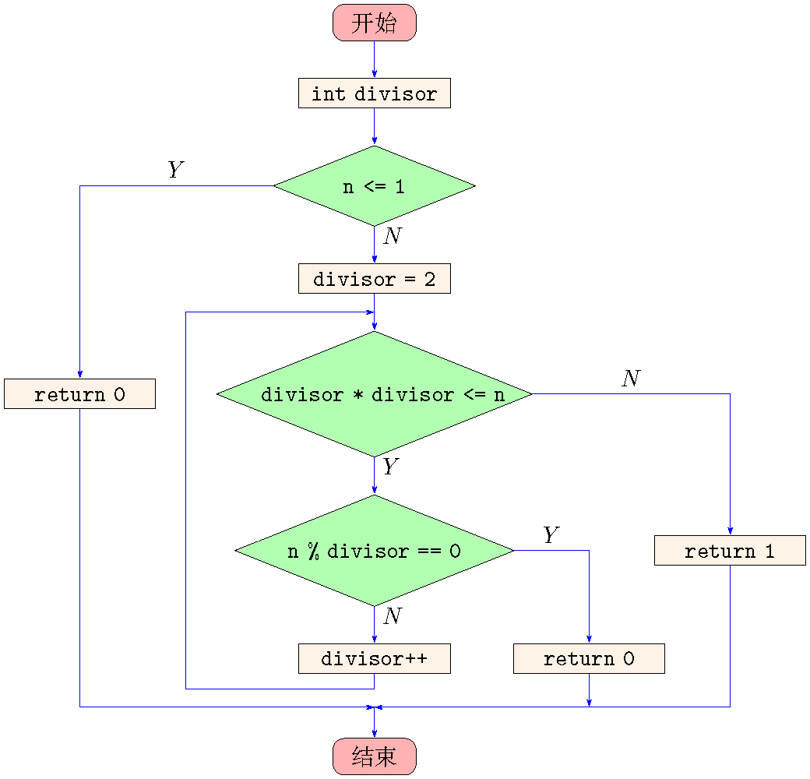

# tikz-flowchat

## 介绍
这是一个使用TiKZ绘制传统程序流程图的简单宏包，通过定义`proc`、`test`、`term`等`node`样式实现。该宏包核心代码摘录自[Brent Longborough](http://www.texample.net/tikz/examples/author/brent-longborough/)设计的流程图绘制样例，参考了tikz-imagelabels宏包的设计思路，提供了`\flowchartset`命令以设置绘制参数。

Happy LaTeXing！~




## `\flowchartset`命令
`\flowchartset`命令用于设置绘制参数，详细说明如下：

```
% 各绘图参数及其默认值
\flowchartset{
  free color = green,                % 自由连线颜色(默认取green)
  norm color = blue,                 % 常规连线颜色(默认取blue)
  cong color = red,                  % 关联连线颜色(默认取red)
  proc fill color = white,           % 顺序处理框填充颜色(默认取白色)
  test fill color = white,           % 判断框填充颜色(默认取白色)
  io fill color = white,             % 输入/输出框填充颜色(默认取白色)
  term fill color = white,           % 开始/结束框填充颜色(默认取白色)
  proc text width = 8em,             % 顺序处理框宽度(默认取8em)
  test text width = 5em,             % 判断框宽度(默认取5em)
  io text width = 6em,               % 输入/输出框宽度(默认取6em)
  term text width = 3em,             % 开始/结束宽度(默认取3em)
  chain direction = below,           % 结点自动布置方向(默认取below)
  minimum node distance = 6mm,       % 最小结点间距(默认取6mm)
  maximum node distance = 60mm,      % 最大结点间距(默认取60mm)
  border line width = \pgflinewidth, % 各类流程框边框宽度(默认取当前线条宽度)
  flow line width = \pgflinewidth,   % 各类流程线线条宽度(默认取当前线条宽度)
  stealth length = 1.5mm,            % 箭头长度(默认取1.5mm)
  stealth width = 1.0mm,             % 箭头宽度(默认取1.0mm)
}

```

## 注意

1. 本文档要求 TeXLive、MacTeX、MikTeX 不低于 2018 年的发行版，并且尽可能升级到最新，强烈建议使用TeXLive2019。

2. **不支持** [CTeX 套装](http://www.ctex.org/CTeXDownload)。
